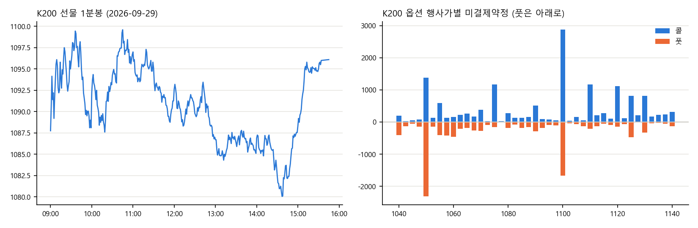

# 한국투자증권 Open API 시장 데이터 수집

한국투자증권(KIS) Open API로 국내 파생·수급 데이터와 미국 지수·종목 데이터를 평일마다 수집합니다. GitHub Actions가 정해진 시각에 API를 호출하고 결과를 JSON으로 저장합니다. 이 데이터로 인스타그램 [@winwin_macro](https://www.instagram.com/winwin_macro)에 매일 시장 카드뉴스를 올립니다.



## 수집 시각

| 한국시간 | 카드뉴스 | 주요 데이터 |
|---|---|---|
| 평일 12:55 | 국장 장중 파생 수급 | K200 선물 흐름, 베이시스, 미결제약정, 옵션 전광판, 투자자별 순매수 |
| 평일 15:50, 16:05 | 국장 마감 | 코스피·코스닥 5분봉, 투자자별 순매수, 프로그램매매 (16:05는 확정치 재수집) |
| 화~토 07:00 | 미장 마감 | NDX·SPX·COMP·VIX 5분봉, QQQ·SPY·NVDA 정규장 1분봉 |

## 수집 항목

| 구분 | 항목 | API |
|---|---|---|
| K200 선물 | 현재가, 1분봉(정규장 전체), 베이시스, 이론가, 미결제약정 | `FHMIF10000000`, `FHKIF03020200` |
| K200 옵션 | ATM ±20 행사가 콜·풋의 IV, 델타·감마·베가·세타, 미결제약정 → P/C 비율, 최대 미결제 행사가, ATM IV | `FHPIF05030100` |
| 선물 포지션 | 가격 방향과 미결제 증감으로 신규매수, 숏커버, 신규매도, 롱청산 구분 | |
| 수급 | 투자자별 순매수, 프로그램매매(차익·비차익), 투자자별 프로그램매매 | 국내주식 시세 API |
| 미국 | 지수 5분봉, ETF·종목 1분봉 (`SESSION=premarket`이면 프리마켓, CPI처럼 개장 전 발표가 있는 날용) | `FHKST03030200`, `HHDFS76950200` |

결과: `data/kr/latest.json`, `data/us/latest.json` (최신), `data/kr/YYYYMMDD.json` (날짜별 보관)

## 수집하면서 해결한 문제

| 문제 | 해결 |
|---|---|
| 옵션 시세가 한 번에 100개까지만 와서, 행사가가 많은 날은 등가격 근처가 빠짐 | 등가격 주변 행사가를 골라 하나씩 따로 조회 |
| 해외 종목 분봉이 한 번에 120개, 최신→과거 순으로만 옴 | 이전 페이지의 가장 오래된 봉 1분 전으로 옮겨가며 09:30까지 거슬러 올라감 |
| 지수 분봉은 페이징이 없어 최근 102봉만 옴 | 5분봉으로 받아 정규장(390분 = 78봉)을 한 번에 덮음 |
| 문서 예제대로 요청하면 오류가 나는 API가 있음 | 필요한 입력값을 직접 시험해 찾아냄 |
| 투자자별 매매 동향이 부호가 반대로 나오는 경우가 있음 | 네이버 금융 수치와 대조해 맞는 API만 사용 |
| 실행할 때마다 접근 토큰을 새로 받으면 발급 제한(1분 1회)에 걸림 | 토큰을 캐시해 하루 1번만 발급 |
| 선물 근월물 종목코드가 만기마다 바뀜 | 만기일(둘째 목요일)을 계산하고 종목 마스터에서 자동으로 찾아 저장 |

## 구성

```
scripts/
  kis.py          토큰 발급·캐시, 공통 요청 함수 (키는 환경변수)
  collect_kr.py   국장: K200 선물·옵션, 지수 분봉, 투자자·프로그램 수급
  collect_us.py   미장: 지수 5분봉, 종목 1분봉 (페이징)
  fo_master.py    선물옵션 종목 마스터 → 근월물 코드·행사가 찾기
.github/workflows/
  collect-kr.yml  평일 12:55, 15:50, 16:05 KST
  collect-us.yml  화~토 07:00 KST
```

## 실행

1. KIS Developers에서 앱키·앱시크릿 발급
2. 저장소 Settings → Secrets and variables → Actions에 `KIS_APP_KEY`, `KIS_APP_SECRET` 등록 (코드·파일에는 키를 넣지 않음)
3. Actions 탭에서 `collect-kr` 또는 `collect-us`를 Run workflow로 실행

```bash
pip install -r requirements.txt
KIS_APP_KEY=... KIS_APP_SECRET=... PYTHONPATH=scripts python scripts/collect_kr.py
```
